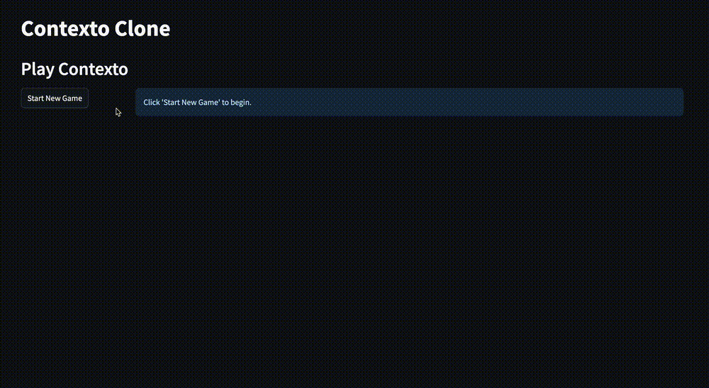
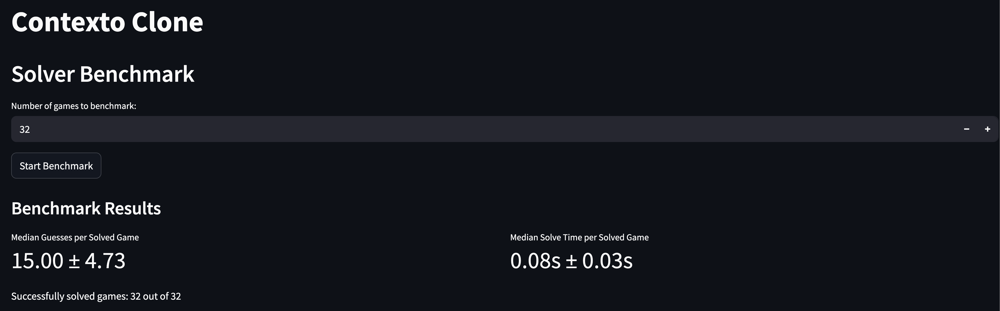
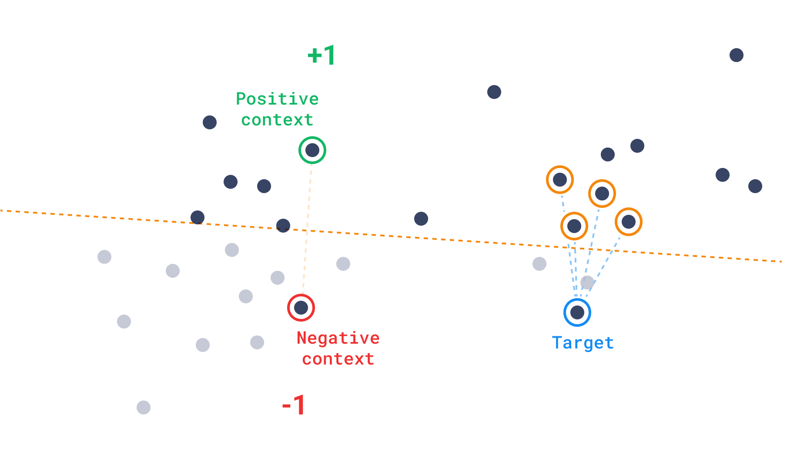

<div id="top"></div>

<!-- PROJECT LOGO -->
<br />
<div align="center">
  

  <h1 align="center">Contexto Solver</h1>
  <h4 align="center">A Python application that simulates and solves the Contexto game.</h4>

  <!-- BADGES -->
  <p align="center">
    <a href="https://github.com/CarlosUziel/contexto-solver/blob/main/LICENSE"></a>
    <a href="https://github.com/CarlosUziel/contexto-solver/stargazers"></a>
  </p>
  
  <p align="center">
    <a href="#-motivation">Motivation</a> •
    <a href="#-getting-started">Getting Started</a> •
    <a href="#-contact">Contact</a>
  </p>
</div>

<!-- TABLE OF CONTENTS -->
<details>
  <summary>📋 Table of Contents</summary>
  <ol>
    <li><a href="#-motivation">🧠 Motivation</a></li>
    <li>
      <a href="#-getting-started">🚀 Getting Started</a>
      <ul>
        <li><a href="#prerequisites">Prerequisites</a></li>
        <li><a href="#installation">Installation</a></li>
        <li><a href="#usage">Usage</a></li>
      </ul>
    </li>
    <li><a href="#-algorithm-explanation">💡 Algorithm Explanation</a></li>
    <li><a href="#-configuration-options">⚙️ Configuration Options</a></li>
    <li><a href="#-license">📄 License</a></li>
    <li><a href="#-contact">👤 Contact</a></li>
    <li><a href="#-acknowledgments">🙏 Acknowledgments</a></li>
  </ol>
</details>

## 🧠 Motivation

[Contexto](https://contexto.me) is a word puzzle game where players try to find a secret word. After each guess, the game tells you the position of your guessed word in a list sorted by similarity to the secret word. The closer your guess is to the secret word, the lower the number.

This repository provides a Python-based solution to simulate and automatically solve the Contexto game. It works by instantiating a simulated version of the game and then employing a solver. The solver leverages the Qdrant vector database's discovery API to find the secret word by iteratively guessing words and narrowing down the search space based on the similarity scores provided by the game.

<p align="right">(<a href="#top">back to top</a>)</p>

<!-- GETTING STARTED -->
## 🚀 Getting Started

### Prerequisites

Before you begin, ensure you have the following installed:

*   **Docker**: To run the Qdrant vector database. [Installation Guide](https://docs.docker.com/get-docker/)
*   **uv**: A fast Python package installer and resolver. [Installation Guide](https://github.com/astral-sh/uv)

### Installation

1.  Clone this repository:
    ```bash
    git clone https://github.com/CarlosUziel/contexto-solver.git
    cd contexto-solver
    ```

2.  Install project dependencies using uv:
    ```bash
    uv sync
    ```

<p align="right">(<a href="#top">back to top</a>)</p>

### Usage

1.  **Set up Environment Variables**:
    Copy the distributed environment file `.env.dist` to `.env` and modify it with your Qdrant settings if necessary (default values should work for a local setup).
    ```bash
    cp .env.dist .env
    ```

2.  **Start Qdrant Docker Instance**:
    Use the provided `docker-compose.yml` to start the Qdrant service.
    ```bash
    docker-compose up -d
    ```

3.  **Populate the Database**:
    Run the setup script to populate the Qdrant database with the word embeddings. Make sure your `PYTHONPATH` includes the `src` directory.
    ```bash
    export PYTHONPATH=./src:$PYTHONPATH
    python src/db/setup_qdrant.py
    ```

4.  **Start the Streamlit App**:
    Launch the Streamlit application.
    ```bash
    streamlit run src/app/contexto_app.py
    ```

The Streamlit application provides the following options:
*   **Normal Game**: Play a simulated Contexto game yourself.
*   **Autosolve**: Watch the solver automatically find the secret word.
*   **Benchmarks**: Run performance tests on the solver.

<br />
<div align="center">
  
</div>
<br />

<p align="right">(<a href="#top">back to top</a>)</p>

## ⚙️ Configuration Options

The application's behavior can be customized through environment variables defined in the `.env` file. Below is a description of these options:

### Qdrant Options

*   `QDRANT_HOST`: Hostname or IP address of the Qdrant server.
    *   Default: `localhost`
*   `QDRANT_GRPC_HOST_PORT`: gRPC port exposed by the Qdrant host for client connections.
    *   Default: `6333`
*   `QDRANT_HTTP_HOST_PORT`: HTTP port exposed by the Qdrant host.
    *   Default: `6334`
*   `QDRANT_GRPC_CONTAINER_PORT`: Internal gRPC port used by the Qdrant container.
    *   Default: `6333`
*   `QDRANT_HTTP_CONTAINER_PORT`: Internal HTTP port used by the Qdrant container.
    *   Default: `6334`
*   `QDRANT_API_KEY`: API key for Qdrant Cloud (optional).
    *   Default: `None`
*   `QDRANT_LOG_LEVEL`: Logging level for the Qdrant service (e.g., 'debug', 'info', 'warning', 'error').
    *   Default: `info`
*   `QDRANT_UUID_NAMESPACE`: Namespace for generating Qdrant point UUIDs. Provide a valid UUID.
    *   Default: `6ba7b810-9dad-11d1-80b4-00c04fd430c8` (corresponds to `uuid.NAMESPACE_DNS`)

### GloVe Dataset

*   `GLOVE_DATASET`: Specifies the GloVe dataset to use for word embeddings. The choice of dataset affects the vocabulary size and the dimensionality of word vectors, which can influence solver performance and resource usage.
    *   Default: `glove.6B.100d`
    *   Available Options:
        *   `glove.6B.50d`
        *   `glove.6B.100d`
        *   `glove.6B.200d`
        *   `glove.6B.300d`
        *   `glove.twitter.27B.25d`
        *   `glove.twitter.27B.50d`
        *   `glove.twitter.27B.100d`
        *   `glove.twitter.27B.200d`
        *   `glove.42B.300d`
        *   `glove.840B.300d`

### Solver Algorithm Parameters

*   `BASE_STEP_SCALE`: Base step scale for the solver's random step fallback mechanism (Fallback Strategy 1). A smaller value results in finer adjustments, while a larger value allows for more significant exploration steps.
    *   Default: `0.05`
*   `QDRANT_HNSW_EF`: The 'ef' (size of the dynamic list for HNSW) parameter for Qdrant search. This affects search speed and accuracy. Higher values can lead to more accurate searches but may increase latency.
    *   Default: `64`
*   `MAX_DISTANT_EMBEDDING_ATTEMPTS`: Maximum attempts to find a distant embedding for context pair generation during the initial phase of the solver (Step 2, First Guess Processing). This is used to find a suitable negative example.
    *   Default: `5`

<p align="right">(<a href="#top">back to top</a>)</p>

## 💡 Algorithm Explanation

The Contexto solver employs a sophisticated, multi-stage strategy to pinpoint the secret word. This process heavily relies on Qdrant's vector search capabilities, especially its [*Discovery API*](https://qdrant.tech/documentation/concepts/explore/#discovery-api), to navigate the word-embedding space efficiently. Let $V$ represent the vector embedding of a word.

Here's a breakdown of the solver's process:

1.  **Initial Guess: $G_0$**
    *   If no guesses have been made (i.e., the set of past guesses $\mathcal{G}_{past}$ is empty), the solver selects a word $w_0$ uniformly at random from the entire collection. Its embedding is $V_0$. This serves as the initial anchor point.

2.  **Iterative Refinement via Discovery Search (for guess $G_i, i \ge 1$)**
    *   Once at least one guess $(w_{prev}, r_{prev}, V_{prev})$ exists, where $r$ is its rank, the solver primarily uses Qdrant's Discovery API.
    *   **Context Pair Generation**: Each guess helps build a list of context pairs $\mathcal{C} = [(V_{pos}^{(j)}, V_{neg}^{(j)})]$. Let $(w_{best}, r_{best}, V_{best})$ be the details of the guess with the lowest rank encountered so far.
        *   **First Guess Processing (to form $(V_{pos}^{(0)}, V_{neg}^{(0)})$ )**: When the first guess $(w_0, r_0, V_0)$ is processed:
            *   The positive example is $V_{pos}^{(0)} = V_0$.
            *   To determine the negative example $V_{neg}^{(0)}$, the solver first attempts to find a random word $w_{rand}$ from the collection such that $w_{rand} \neq w_0$. This attempt is made up to a configured number of times. If a suitable $w_{rand}$ is found and its embedding $V_{rand}$ is retrieved, then $V_{neg}^{(0)} = $V_{rand}$. If these attempts fail to yield a suitable distinct random word, the solver uses the negation of the first guess's embedding as a fallback: $V_{neg}^{(0)} = -V_0$.
            *   $(w_{best}, r_{best}, V_{best})$ is initialized to $(w_0, r_0, V_0)$.
            *   A list of unique embeddings from guesses that improved upon the previous best rank, $\mathcal{V}_{imp}$, is initialized with $V_0$.
        *   **Subsequent Guess Processing (for new guess $(w_{new}, r_{new}, V_{new})$ to form $(V_{pos}^{(k)}, V_{neg}^{(k)})$ )**:
            *   If $r_{new} < r_{best}$ (the new guess is an improvement):
                *   $V_{pos}^{(k)} = V_{new}$
                *   $V_{neg}^{(k)} = V_{best}$ (the embedding of the previous best guess)
                *   Update $(w_{best}, r_{best}, V_{best}) \leftarrow (w_{new}, r_{new}, V_{new})$.
                *   Add $V_{new}$ to $\mathcal{V}_{imp}$ if not already present. (This check handles the rare case where a new, distinct guessed word might have an embedding vector identical to one from a previous improving guess already in $\mathcal{V}_{imp}$.)
            *   Else ($r_{new} \ge r_{best}$):
                *   $V_{pos}^{(k)} = V_{best}$
                *   $V_{neg}^{(k)} = V_{new}$
    *   **Target Vector ($V_{target}$) Determination for Discovery Search**:
        *   When making the **second overall guess** (i.e., after the first random guess $G_0$ has been processed, so $|\mathcal{G}_{past}| = 1$): The discovery search is performed *without* an explicit target vector (the `target` parameter for the Qdrant API call is effectively `None`).
        *   When making the **third or subsequent overall guesses** (i.e., $|\mathcal{G}_{past}| > 1$):
            *   $V_{target}$ is calculated as the centroid of $\mathcal{V}_{imp}$ (the list of unique embeddings from guesses that improved upon the previous best rank). Since $\mathcal{V}_{imp}$ is initialized with $V_0$ (the embedding of the first guess) and only has further improving embeddings added, it will be non-empty at this stage. Thus, the target is: $V_{target} = \frac{1}{|\mathcal{V}_{imp}|} \sum_{V \in \mathcal{V}_{imp}} V$.
    *   **Exclusion Filter**: A filter is applied to exclude all words $w \in \mathcal{G}_{past}$ from the search results.
    *   **Discovery API Call**: Qdrant is queried using $\mathcal{C}$, $V_{target}$, and the exclusion filter.
        *   The number of candidates requested (`limit`) is 10 if this is the second word being guessed overall (i.e., $|\mathcal{G}_{past}| = 1$), promoting broader exploration initially. Otherwise, `limit` is 1.
    *   If this yields a new, valid word $w_{candidate} \notin \mathcal{G}_{past}$, it becomes the next guess.

> ℹ️ **Understanding Qdrant's Discovery API**
> 
> The Discovery API is designed to find points in the vector space that are semantically similar to a set of "positive" example vectors while being dissimilar to a set of "negative" example vectors.
> -   **Context Pairs ($\mathcal{C}$)**: These pairs $(V_{pos}, V_{neg})$ guide the search. The API tries to find vectors closer to $V_{pos}$ and further from $V_{neg}$ for each pair.
> -   **Target Vector ($V_{target}$)**:
>     -   If a `target` vector is provided, the search is biased towards this specific point in space, in addition to satisfying the positive/negative constraints. This helps to steer the exploration towards a region of interest deemed promising by the solver (e.g., the centroid of good guesses).
>     -   If no `target` is provided (i.e., `target` is `None`), the API focuses solely on optimizing based on the given positive and negative context pairs, looking for items that best satisfy these relative relationships without a specific anchor point. This is useful early on, like for the second guess, to explore more broadly.
>
> <p align="center">
>  <br>
>  <em>Image extracted from the <a href="https://qdrant.tech/documentation/concepts/explore/#discovery-api">Qdrant Discovery API documentation</a>.</em>
> </p>

### Fallback Strategies and Failure Condition

If the primary Discovery Search (Step 2) does not yield a new candidate word, the solver resorts to the following strategies:

1.  **Fallback Strategy 1: Perturbation from Best Guess**
    *   Let $V_{best}$ be the embedding of the current best guess in $\mathcal{G}_{past}$.
    *   A new point in the embedding space is defined as $V_{pert} = V_{best} + s \cdot \hat{d}$, where $\hat{d}$ is a random unit vector and $s$ is a predefined step scale.
    *   The solver queries Qdrant for the word whose embedding is closest to $V_{pert}$, excluding words in $\mathcal{G}_{past}$. If found, this word is the next guess.

2.  **Fallback Strategy 2: Filtered Random Guess**
    *   If prior strategies fail, the solver attempts up to $N_{attempts}$ (e.g., 5) times to fetch a random word $w_{rand}$ such that $w_{rand} \notin \mathcal{G}_{past}$.
    *   If these attempts do not yield a *new* random word, one final random word is fetched (this may be a repeat if $\mathcal{G}_{past}$ is large relative to the collection size).

3.  **Failure Condition**
    *   If all strategies are exhausted and no valid guess can be determined, the solver signals an inability to continue.

This iterative cycle of guessing, receiving rank feedback, updating context ($\mathcal{C}, V_{target}, \mathcal{V}_{imp}$), and strategically querying the vector database allows the solver to progressively narrow the search space towards the secret word.

<p align="right">(<a href="#top">back to top</a>)</p>

<!-- LICENSE -->
## 📄 License

Distributed under the MIT License. See `LICENSE` for more information.

<p align="right">(<a href="#top">back to top</a>)</p>

<!-- CONTACT -->
## 👤 Contact

<div align="center">
  <a href="https://github.com/CarlosUziel"></a>
  <a href="https://scholar.google.co.uk/citations?user=tEz_OeIAAAAJ&hl"></a>
  <a href="https://www.linkedin.com/in/carlosuziel"></a>
  <a href="https://perez-malla.com/"></a>
</div>

<p align="right">(<a href="#top">back to top</a>)</p>

<!-- ACKNOWLEDGEMENTS -->
## 🙏 Acknowledgments

This repository proposes a solution to the [Contexto Challenge](https://gist.github.com/generall/98e18d5afae16bf444eff05c9fc7b74d), which relies on the [Qdrant](https://qdrant.tech/) vector database for efficient vector storage and retrieval. [This other solution](https://github.com/qdrant/contexto) was used as a reference to better understand the Contexto game mechanics and potential strategies.

<p align="right">(<a href="#top">back to top</a>)</p>
